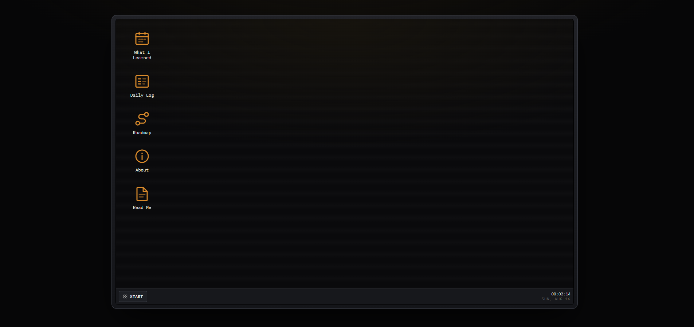

# trajectory

> **Everything in this log is written by me.** On a day I don't have time to
> sit down and write, I pre-write entries ahead of time so the day still gets
> filled if I forget. Nothing here is generated.

A desktop environment for a daily learning log.

Every day I file what I picked up into one of three folders: **Professional**,
**Personal**, and **Cool Facts**. The site renders those notes as a windowed OS
you can browse, drag around, and stack.

This isn't a portfolio. It's the place things go before they evaporate.
